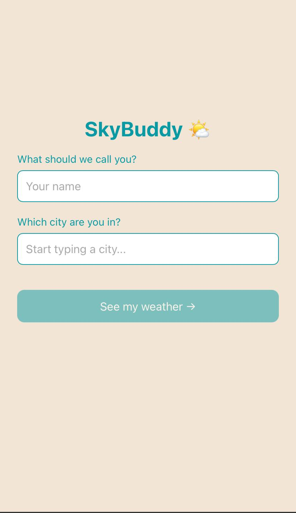
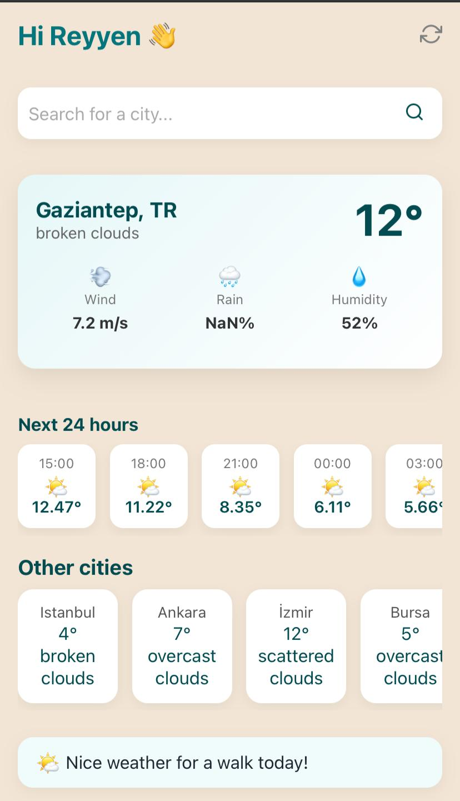

# 🌤️ SkyBuddy

SkyBuddy is a modern weather web app that provides real-time weather information, hourly forecasts, and weather conditions for multiple cities. Users can search for any city and instantly view current weather and nearby major cities in the same country.

---

## ✨ Features

- 🔍 Search for any city worldwide
- 🌡️ Real-time weather data
- 🕐 24-hour hourly forecast
- 🌍 Automatic suggestions for other major cities in the same country
- 💡 Smart weather tips based on conditions
- 📱 Responsive design (mobile + desktop)
- ⚡ Fast and lightweight

---
### Screens

   
  

## 🛠️ Tech Stack

### Frontend
- React
- TypeScript
- Vite
- CSS Modules

### APIs
- OpenWeather API → weather data
- GeoDB Cities API → city and country data

### Tools
- RapidAPI
- npm
